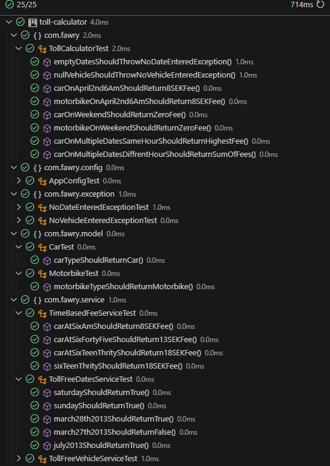
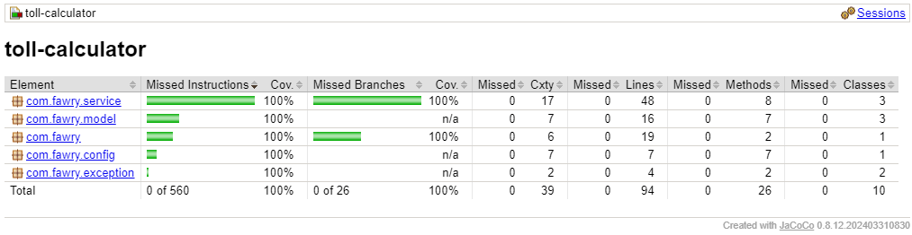

# Toll Fee Calculator (v1.0)

## Introduction
This project implements a toll fee calculator in Sweden for vehicles, considering time of day, vehicle type, and other factors.

## Requirements
* Fees: SEK(Swedish Krona) 8-18 based on time (rush hour = highest fee)
* Daily Maximum: SEK(Swedish Krona) 60 per vehicle
* Intra-Hour Charging: Only charged once per hour (highest fee applies)
* Toll-Free Vehicles: Specific vehicle types and weekends/holidays
* Deployment: Multi-region deployment
* Flexibility: Accepts different dates

## Dependencies
This project is built with:
1. Java 17
2. Maven 3.9.6
3. spring-core 6.1.5
4. spring-beans 6.1.5
5. spring-context 6.1.5
6. junit 4.13.2
7. jacoco 0.8.12.

## Installation and Usage
1. Clone the repository: ```git clone https://github.com/xMansour/Toll-Calculator.git```
2.  Navigate to the project directory: ```cd toll-fee-calculator```
3. Install dependencies: ```mvn install```
4. Run unit tests: ```mvn test```
5. Generate code coverage report: ```mvn jacoco:prepare-agent test install jacoco:report``` This will generate a code coverage report in the target/site/jacoco directory.


## Unit Tests
Our toll calculator system is thoroughly tested with a suite of 25 unit tests that cover the entire logic.  


Here's the test coverage report, which could be generated and accessed as mentioned above.  

